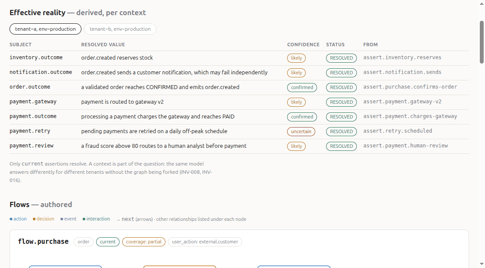
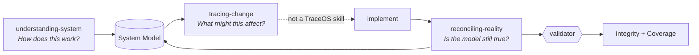
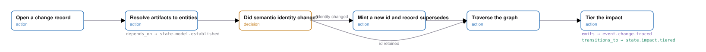
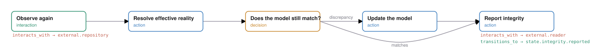

# TraceOS

> **Trace before change. Reconcile after change.**

A semantic layer that lets a coding agent see a system as behavior rather than as
files — so it can work out what a change might affect *before* making it, and check
whether the model is still true *after*.

A coding agent goes `search → modify → test`. It can change `PaymentService` without
knowing that payment participates in purchase, refund, subscription, notification and
risk. The dependency graph shows `PaymentService → PaymentRepository → StripeAdapter`
and says nothing about any of that. TraceOS is the missing layer.



## TraceOS, described in TraceOS

The repository models itself — [`examples/traceos-itself/`](examples/traceos-itself)
is a TraceOS model of TraceOS, validated in CI like any other. These diagrams are
generated from it.



**Trace before change** — resolve the diff to entities, decide whether identity
survived, walk the graph, tier the result:

<picture>
  <source media="(prefers-color-scheme: dark)" srcset="docs/assets/flow-trace-dark.svg">
  
</picture>

**Reconcile after change** — observe again, resolve effective reality, and only then
decide whether the model has to move:

<picture>
  <source media="(prefers-color-scheme: dark)" srcset="docs/assets/flow-reconcile-dark.svg">
  
</picture>

Writing the code sits between them and is deliberately **not** a TraceOS skill — it
is the agent's ordinary work, modelled as a stub so the loop has no hidden gap.

## The one mechanism

TraceOS runs a single integrity mechanism, three times:

> **An authored claim is checked against a derived measurement.**

| Authored claim | Derived measurement | Check |
|---|---|---|
| `confidence_asserted` | computed from the observation log | `asserted ≤ computed` |
| `coverage_declared` | measured from artifact→node mapping | `complete ⇒ no gaps` |
| Assertion claim | Effective Reality after resolution | `claim ≠ resolved ⇒ discrepancy` |

**Reconciliation** closes a gap in that table. **Integrity** is whether one is open.

Which is why nothing derivable is ever written down. There is no `reality.md`:
storing Reality creates a second model that can also be wrong. Confidence, Coverage,
Impact and Integrity are computed on demand, and the validator rejects them if it
finds them in an authored file.

## Two failure modes it is built to refuse

**A second, quietly stale copy of the truth.** Anything both hand-written and
derivable will drift. So Assertions are authored; everything downstream is computed.

**Confidence in a partial model.** Absence is not in the model, so a coverage query
takes the repository file list as input, every impact result carries an `unknown`
tier, and coverage reports counts and named gaps. No percentage, no green 100% bar —
full artifact mapping does not mean the behavior is modelled.

## Quick start

Python 3.11+, `pyyaml`, `jsonschema`.

```bash
# scaffold a model into an existing repository
python3 tools/traceos.py init /path/to/repo --name "My System"

# the reference model
cd examples/ecommerce
python3 ../../tools/traceos.py validate . --repo-files repo-files.txt
python3 ../../tools/traceos.py resolve  . --context tenant=a    # → gateway v2
python3 ../../tools/traceos.py resolve  . --context tenant=b    # → gateway v1
python3 ../../tools/traceos.py impact   . --changed "src/refund/RefundService.ts"
python3 ../../tools/traceos.py explore  . --repo-files repo-files.txt --out /tmp/x.html
```

One graph answers differently per tenant without being forked. A file that maps to
nothing comes back as `unknown`, not as silence.

Record what you actually checked, stamped with the real commit:

```bash
python3 tools/traceos.py observe traceos \
  --assertion assert.invoice.issues \
  --reference "src/billing/InvoiceService.ts#issue" --supports supports
```

Pass `--repo` to `validate` and `resolve` and observations are checked against git:
once a commit touches an observed file, confidence drops from `confirmed` to
`uncertain` **with no model file edited**. A ref that is not in the repository caps
confidence and is reported — unverifiable is not the same as verified.

## Layout

```
docs/semantic-specification.md   the definition — 22 numbered invariants
docs/decisions/                  14 ADRs — why each rule exists
schema/traceos.schema.json       frontmatter structure
examples/ecommerce/              reference model touching every entity
examples/traceos-itself/         TraceOS modelled in TraceOS
skills/                          three agent skills over a shared reference/
tools/traceos.py                 engine: init, observe, validate, resolve,
                                 impact, diff, coverage, explore
tests/run_tests.py               13 stress cases, 7 invariants, 4 tooling groups
```

## Status

v0.1 is a semantic baseline with a working reference implementation: production-ready
**as a specification**, not yet as tooling. The known gaps are measured rather than
guessed — see [the risks still carried](docs/DEVELOPMENT-PLAN.md#risks-this-design-is-still-carrying)
and the [changelog](CHANGELOG.md). The shortest one: the validator cannot verify an
identity decision, so a graph diff is objective only if ids were assigned correctly,
and the specification says so out loud.

```
v0.1  Semantic foundation + reference engine   ← here
v0.2  Parser / model engine
v0.3  Agent integration
v0.4  Graph explorer
v0.5  Change impact engine
v1.0  Production-grade TraceOS
```

## License

MIT — see [LICENSE](LICENSE).
