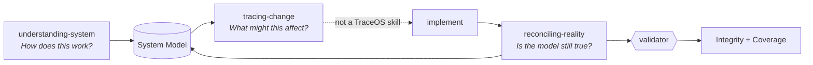

# TraceOS

> ## Software behavior, accountable to intent.

A claim about what a system does is **accountable** when it can be traced back to the
decision that asked for it, and forward to an outcome capable of contradicting it.
Nothing today does both: code annotations trace backward, monitoring traces forward, and
neither can tell you that a behavior quietly stopped matching what it was for.

**Where that stands, honestly:**

| Layer | | Status |
|---|---|---|
| **Behavior** | the Flow graph, evidence, impact, erosion detection | **works** — modelled against itself in CI |
| **Outcome** | an outcome names the check that says whether it occurred; a `refutes` there is an **error** | **mechanism works, value unproven** — INV-027, the only place reality can contradict the model |
| **Intent** | a flow cites the frozen decision that asked for it, verified by provenance | **mechanism works, value unproven** — INV-028, citing the ADRs you already write rather than adding a format |

"Value unproven" is not modesty. The mechanism is built, tested and enforced; what has
**not** been run is the measurement that would justify it — take three incidents that
actually happened and ask whether this would have caught any before they became one.
That kill condition is written down in
[ADR-015](docs/decisions/015-intent-behavior-outcome.md) and has not been answered.

The direction, the four horizons and the measurement that would kill each of them are in
[`docs/DIRECTION.md`](docs/DIRECTION.md). Nothing on that page is claimed as shipped.

---

> **Trace before change. Reconcile after change.**

That is the part that runs. A semantic layer that lets a coding agent see a system as
behavior rather than as files — so it can work out what a change might affect *before*
making it, and check whether the model is still true *after*.

A coding agent goes `search → modify → test`. It can change `PaymentService` without
knowing that payment participates in purchase, refund, subscription, notification and
risk. The dependency graph shows `PaymentService → PaymentRepository → StripeAdapter`
and says nothing about any of that. TraceOS is the missing layer.

[](https://junixlabs.github.io/traceos/)

**[Open the live models →](https://junixlabs.github.io/traceos/)** — the explorer running against both reference models, regenerated on every push.

## TraceOS, described in TraceOS

The repository models itself — [`examples/traceos-itself/`](examples/traceos-itself)
is a TraceOS model of TraceOS, validated in CI like any other. These diagrams are
generated from it.



**Trace before change** — resolve the diff to entities, decide whether identity
survived, walk the graph, tier the result:

<picture>
  <source media="(prefers-color-scheme: dark)" srcset="docs/assets/flow-trace-dark.svg">
  
</picture>

**Reconcile after change** — observe again, resolve effective reality, and only then
decide whether the model has to move:

<picture>
  <source media="(prefers-color-scheme: dark)" srcset="docs/assets/flow-reconcile-dark.svg">
  
</picture>

Writing the code sits between them and is deliberately **not** a TraceOS skill — it
is the agent's ordinary work, modelled as a stub so the loop has no hidden gap.

## The one mechanism

TraceOS runs a single integrity mechanism, three times:

> **An authored claim is checked against a derived measurement.**

| Authored claim | Derived measurement | Check |
|---|---|---|
| `confidence_asserted` | computed from the observation log | `asserted ≤ computed` |
| `coverage_declared` | measured from artifact→node mapping | `complete ⇒ no gaps` |
| Assertion claim | Effective Reality after resolution | `claim ≠ resolved ⇒ discrepancy` |

**Reconciliation** closes a gap in that table. **Integrity** is whether one is open.

Which is why nothing derivable is ever written down. There is no `reality.md`:
storing Reality creates a second model that can also be wrong. Confidence, Coverage,
Impact and Integrity are computed on demand, and the validator rejects them if it
finds them in an authored file.

## Two failure modes it is built to refuse

**A second, quietly stale copy of the truth.** Anything both hand-written and
derivable will drift. So Assertions are authored; everything downstream is computed.

**Confidence in a partial model.** Absence is not in the model, so a coverage query
takes the repository file list as input, every impact result carries an `unknown`
tier, and coverage reports counts and named gaps. No percentage, no green 100% bar —
full artifact mapping does not mean the behavior is modelled.

## Quick start

Python 3.11+. Install the engine, then drive it from anywhere:

```bash
pip install .
traceos --help
traceos init /path/to/repo --name "My System"

# the reference model
cd examples/ecommerce
traceos validate . --repo-files repo-files.txt   # a fixture; a real repo uses --repo .
traceos resolve  . --context tenant=a    # → gateway v2
traceos resolve  . --context tenant=b    # → gateway v1
traceos impact   . --changed "src/refund/RefundService.ts"
traceos explore  . --repo-files repo-files.txt --out /tmp/x.html
```

One graph answers differently per tenant without being forked. A file that maps to
nothing comes back as `unknown`, not as silence.

Record what you actually checked, stamped with the real commit:

```bash
traceos observe traceos \
  --assertion assert.invoice.issues \
  --reference "src/billing/InvoiceService.ts#issue" --supports supports
```

Pass `--repo` to `validate` and `resolve` and observations are checked against git:
once a commit touches an observed file, confidence drops from `confirmed` to
`uncertain` **with no model file edited**. A ref that is not in the repository caps
confidence and is reported — unverifiable is not the same as verified.

## Layout

```
docs/semantic-specification.md   the definition — 28 numbered invariants
docs/decisions/                  15 ADRs — why each rule exists
docs/DIRECTION.md                where this is going, and what would kill each step
traceos/schema/traceos.schema.json  frontmatter structure
examples/ecommerce/              reference model touching every entity
examples/traceos-itself/         TraceOS modelled in TraceOS
skills/                          three agent skills over a shared reference/
traceos/engine.py                model, validation, resolution, impact, coverage
traceos/explore.py               the HTML view
traceos/site.py                  the Pages site, built from the models
traceos/cli.py                   command line: init, observe, validate, resolve,
                                 impact, diff, coverage, explore
tests/run_tests.py               13 stress cases, 9 invariants, 16 tooling groups
```

## Status

v0.2. A semantic baseline with a working reference implementation: production-ready **as
a specification**, and honest rather than finished **as tooling**. The known gaps are
measured rather than guessed — the [changelog](CHANGELOG.md) and the
[issue tracker](https://github.com/junixlabs/traceos/issues) carry them with their
numbers.

The roadmap is no longer a feature list. It is four horizons, each with the measurement
that would kill it, in [`docs/DIRECTION.md`](docs/DIRECTION.md):

| | | Decided by |
|---|---|---|
| **H1** Erosion, gated | largely built | the cost of keeping a model current — unmeasured (#10) |
| **H2** Outcome carries evidence | mechanism built | three real incidents: would it have caught any? (ADR-015) |
| **H3** Intent as provenance | built | whether teams can cite a frozen record at all |
| **H4** The loop crosses layers | not started | whether four impact tiers survive a dense graph (#5) |

**The old roadmap said v0.2 was "parser / model engine". Measurement retired that line.**
Git already ships per-language funcname heuristics, and `git log -L` narrowed 145 of this
repository's file-level decay events to 23 — so the parser this project was going to build
is one it should never build, and the entry was replaced rather than rescheduled.

Two things nothing on that list fixes, and both are written down rather than deferred:
the validator cannot verify an identity decision, so a graph diff is objective only if
ids were assigned correctly; and **no mechanism here detects a claim that is simply
wrong** (#42, #45) — only one that has gone stale.

## License

MIT — see [LICENSE](LICENSE).
